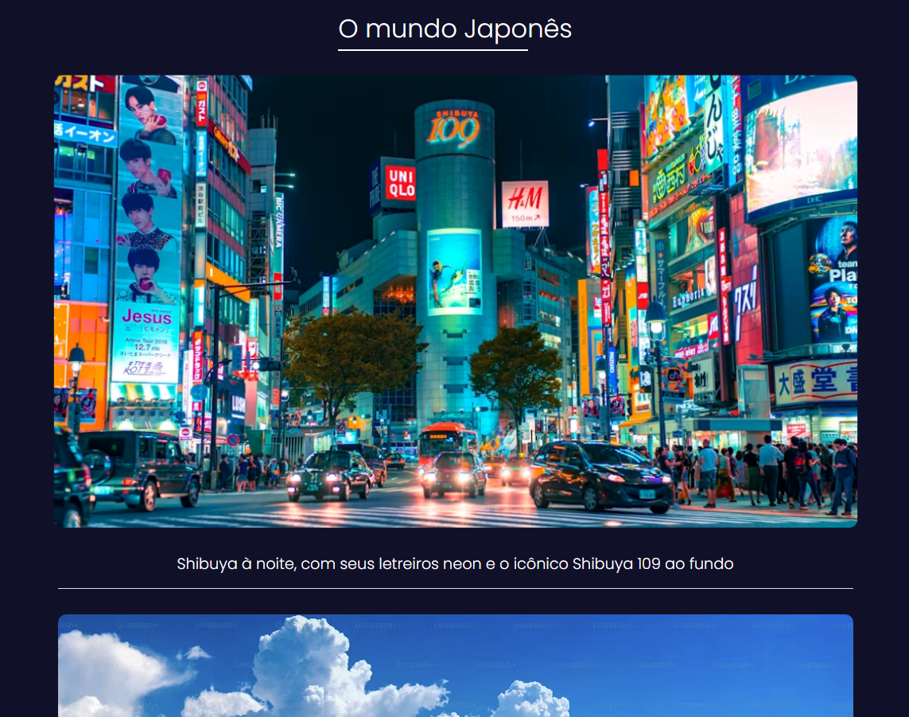

# 🗾 O Mundo Japonês

Aplicação web desenvolvida com HTML, CSS e JavaScript que exibe uma galeria de imagens do Japão com carregamento otimizado via Lazy Loading.

O projeto implementa troca dinâmica de resolução de imagens conforme o usuário scrolla a página, além de animações CSS e layout responsivo.

## 📸 Preview

## 🚀 Demonstração

🔗 Acesse no GitHub Pages: *[Link](Link)*

## 🛠️ Tecnologias utilizadas

- HTML5
- CSS3
- JavaScript (Vanilla JS)

## 📄 Funcionalidades

- Lazy loading de imagens com troca automática de resolução ao entrar na viewport
- Efeito hover com zoom e elevação suave nas imagens
- Animação de sublinhado no título ao passar o mouse
- Layout responsivo com breakpoints para tablet e mobile
- Scroll suave entre seções
- Lightbox ao clicar na imagem, com carregamento progressivo de alta resolução em background

## 🎯 Conceitos aplicados

- IntersectionObserver API para detecção de visibilidade de elementos
- Manipulação de atributos DOM (substituição dinâmica de src)
- Pseudo-elementos CSS (::after) para animações decorativas
- Responsividade com media queries e unidades dvw/dvh
- Boas práticas de performance com unobserve após carregamento
- Uso de object-fit e aspect-ratio para imagens responsivas
- Display inline-block para controle preciso de área de hover
- Carregamento progressivo de imagens (baixa → alta resolução)
- Manipulação do DOM para exibição de lightbox

## 👤 Autor

Desenvolvido por **Christofer Torres**  
Projeto criado para fins de estudo e **portfólio front-end**.